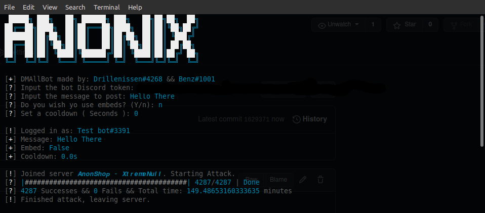

# Discord-DM-All-Bot

## Installation
Here is the list of requements:
* colored
* discord.py

## How to use
1. Run the file `main.py` it will first ask you for a discord bot token here it is very important in the discord dev portal to check on member indents or the bot will not work properbly
2. Second it will ask you for a message to send in discord this can be left blank
3. Third it will ask you if you want to use embeds if so you can create and visuelise one [here](https://leovoel.github.io/embed-visualizer/) just copy the json data from that into the json file the bot creates
4. Fourfth will be a cooldown in seconds, i recommend 5 seconds to avoid getting your bot banned by discord, you can set this to 0 for guilds under 50 ive found
